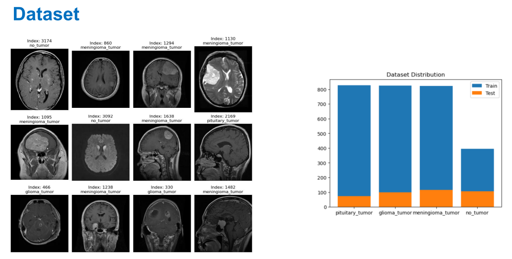
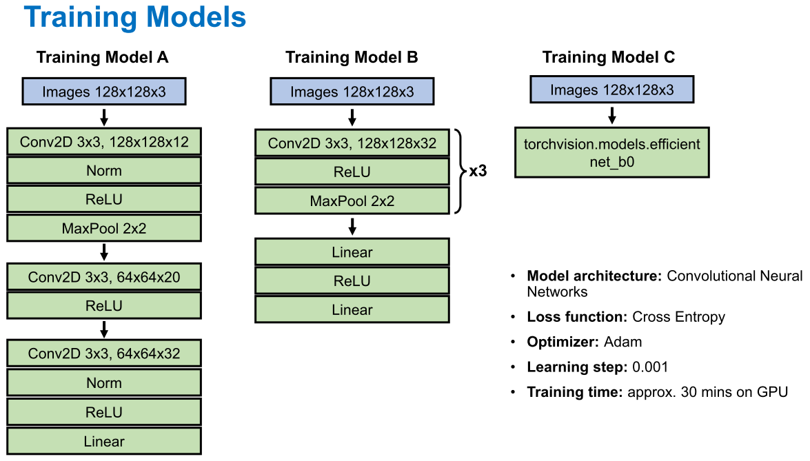
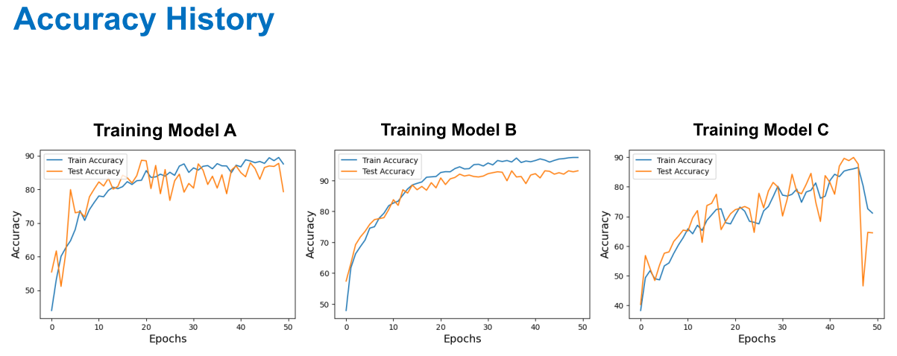

# Brain Tumor Classification from MRI Images using PyTorch

This project develops and evaluates three different Convolutional Neural Network (CNN) architectures for classifying brain tumors into four categories from MRI scans: **glioma, meningioma, pituitary tumor, and no tumor**.

The primary goal was to systematically compare a custom-built CNN against a deeper variant and a state-of-the-art pre-trained model (EfficientNet-B0) to assess the effectiveness of transfer learning for this medical imaging task.

<p align="center">
  
</p>

---

## Key Features

-   **Multi-Model Comparison:** Implemented and trained three distinct CNN models from scratch and using transfer learning.
-   **Data Augmentation:** Utilized image augmentation techniques (resizing, flipping, rotation) to improve model generalization and prevent overfitting.
-   **End-to-End Pipeline:** A complete workflow in PyTorch, from data loading and preprocessing to model training, evaluation, and visualization of results.
-   **High Performance:** The best model achieved **over 90% accuracy** on the test set, demonstrating the viability of deep learning for automated diagnostic support.

---

## Model Architectures

Three models were trained and evaluated:
1.  **Model A:** A custom-built shallow CNN.
2.  **Model B:** A deeper version of the custom CNN with more layers.
3.  **Model C:** A fine-tuned, pre-trained **EfficientNet-B0** model, leveraging transfer learning.



---

## Results

All three models were trained for 50 epochs. The accuracy plots below show that the deeper custom CNN (Model B) and the transfer learning model (Model C) significantly outperformed the shallow CNN (Model A). Model B demonstrated the most stable convergence on the test set.

<p align="center">
  
</p>

---

## Installation & Usage

1.  **Clone the repository:**
    ```bash
    git clone https://github.com/guanshengdu/SS24-V56-project-final.git
    cd SS24-V56-project-final
    ```

2.  **Install dependencies:**
    ```bash
    pip install -r requirements.txt
    ```

3.  **Download the Dataset:**
    The dataset used is the "Brain Tumor MRI Dataset" from Kaggle. You can download it [here](https://www.kaggle.com/datasets/sartajbhuvaji/brain-tumor-classification-mri). Unzip and place the `Training` and `Testing` folders inside a `data/` directory in the project root.

4.  **Run the notebook:**
    Open and run the `brain-tumor-classification-mri.ipynb` Jupyter Notebook to see the full workflow.

---

## Future Work

To further improve performance, the following steps could be taken:
-   **Advanced Architectures:** Implement segmentation models like U-Net to not only classify but also localize the tumor.
-   **Attention Mechanisms:** Incorporate attention layers to help the model focus on the most relevant regions of the MRI scan.
-   **Advanced Loss Functions:** Experiment with focal loss or Dice loss to better handle any potential class imbalance.```
